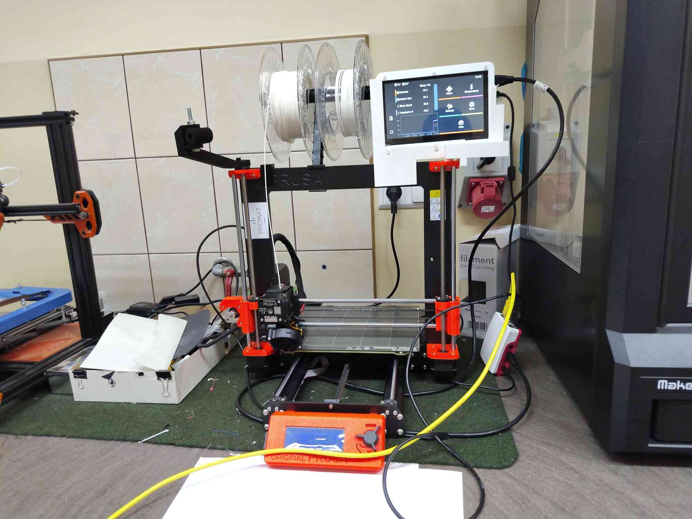
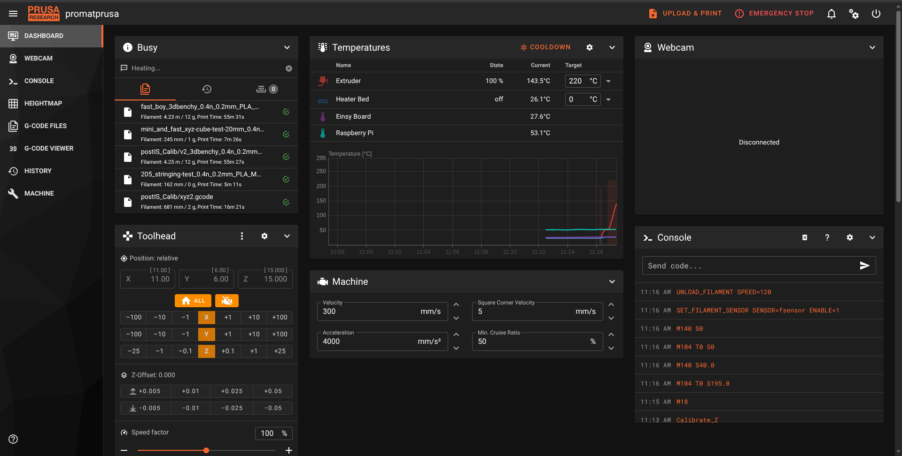
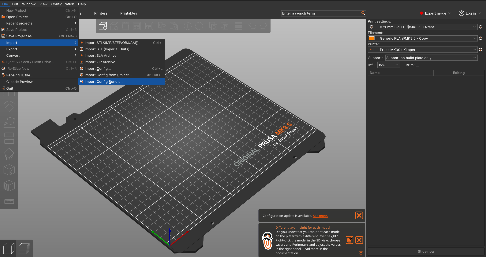

# Wstęp

Po modyfikacjach nasza drukarka 3D korzysta z firmware [klipper](https://www.klipper3d.org/) co zwiększa jej możliwości i prędkość druku.

Szczeguły procesu modyfikacji można znaleźć [tutaj](./doc/prusa-mod-instruction.pdf)

# Intrukcja Obsługi

> [!caution]
> Druk bezpośrednio z karty w drukarce niestety nie jest już możliwy. Należy skorzystać z metody opisanej poniżej!

## Opis ogólny

Powyższe zdjęcie przedstawia +/- obecny stan drukarki z oznaczonymi elementami:
1. Raspberry Pi - odpowiada za sterowanie drukarką
2. Ekran dotykowy KlipperScreen - wyświetla GUI (coś na kształt starego ekranu i pokrętła). Można z niego odpalać wydruki, ładować/wyładowywać filament e.t.c.
3. Stare kontrolki drukarki - nadal da się ich do czegoś używać ale np. nie da się już puszczać wydruków itd.

## Metody uploadowania gcode

### Metoda 1 - przez WebGUI (MainSail)
Ta metoda wymaga połączenia się z Raspberry przez sieć. Można to zrobić na dwa sposoby
1. Przez hotspot (prusa-promat)*
2. Po kablu ethernet (trzeba u siebie odpalić serwer DHCP)

Następnie:
- Wchodzimy na stronę http://promatprusa.local (ewentualnie po IP)
- Wpisujemy login+hasło do NGNIX
- Dostajemy dashboard mainsaila:

1. Wykres temperatury
2. Konsola (można wysyłać GCode bezpośrednio do drukarki)
3. Emergency Stop (gdyby coś się działo złego) - natychmiast zatrzymuje drukarke (tak jakby wcisnąć ten guzik pod pokrętłem)
4. Tutaj można restartować różne komponenty systemu (sam klipper, całe raspberry, moonraker e.t.c.)
5. Tutaj można wrzucać pliki z GCode

- przechodzimy do zakładku `5`

Przy pomocy `1` możemy wrzucić pliki GCode.

## Aktualizacja profilu w prusa-slicer
Ponieważ używamy klippera, musimy zaktualizować profil drukarki w prusa-slicerze. Najnowszy profil znajduje się [tutaj](./end-user-config/prusa_mk3s+_klipper.ini).

## Uruchamianie wydruków

> [!important]
> Upewnij się, że masz aktualny profil slicera! [Najnowsza wersja znajduje się tutaj](./end-user-config/prusa_mk3s+_klipper.ini)

### Metoda 1 - z WebGUI

- Wybieramy plik w eksploratorze plików i wciskamy `Print`

### Metoda 2 - z ekranu dotykowego KlipperScreen

Na ekranie wybieramy Print -> <nazwa pliku> -> Print

# TODO

- [ ] podpiąć rpi do sieci
- [ ] dodać możliwość uploadów gcode bezpośrednio ze slicera
- [ ] dać issue do https://github.com/xbst/KUSBA/blob/main/Docs/v2-Firmware.md o koniecznośći zmiany docelowego mikrokontrolera w nowym klipperze
- [ ] dodać możliwość druku plików z pendrive wpinanego do rpi
